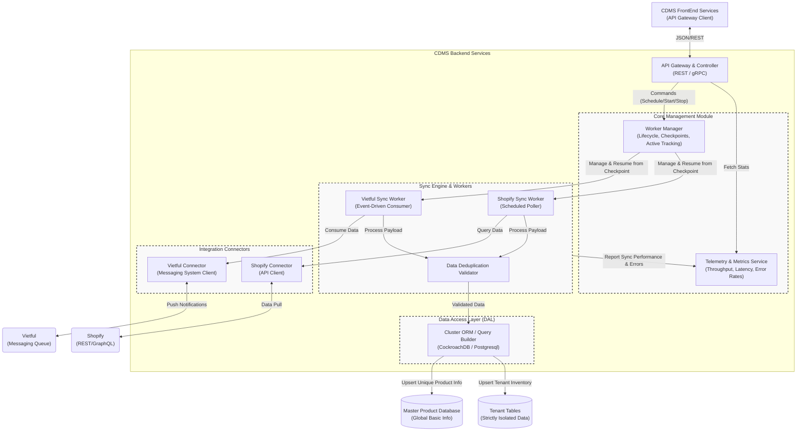

```mermaid
flowchart TD
    %% Khai báo Frontend kết nối vào
    FE["CDMS FrontEnd Services<br>(API Gateway Client)"]

    subgraph BE ["CDMS Backend Services"]
        API["API Gateway & Controller<br>(REST / gRPC)"]
        
        subgraph Management ["Core Management Module"]
            WorkerManager["Worker Manager<br>(Lifecycle, Checkpoints, Active Tracking)"]
            Metrics["Telemetry & Metrics Service<br>(Throughput, Latency, Error Rates)"]
        end
        
        subgraph Workers ["Sync Engine & Workers"]
            VWorker["Vietful Sync Worker<br>(Event-Driven Consumer)"]
            SWorker["Shopify Sync Worker<br>(Scheduled Poller)"]
            Dedup["Data Deduplication Validator"]
        end
        
        subgraph Connectors ["Integration Connectors"]
            VConn["Vietful Connector<br>(Messaging System Client)"]
            SConn["Shopify Connector<br>(API Client)"]
        end
        
        subgraph DAL ["Data Access Layer (DAL)"]
            DBManager["Cluster ORM / Query Builder<br>(CockroachDB / Postgresql)"]
        end
    end

    %% External APIs/Clouds (Dùng hình bo tròn)
    VietfulAPI("Vietful<br>(Messaging Queue)")
    ShopifyAPI("Shopify<br>(REST/GraphQL)")

    %% Databases (Dùng hình trụ cơ sở dữ liệu)
    MasterDB[("Master Product Database<br>(Global Basic Info)")]
    TenantDB[("Tenant Tables<br>(Strictly Isolated Data)")]

    %% Flow logic: FE gọi vào BE
    FE <-->|"JSON/REST"| API

    %% Flow logic nội bộ BE
    API -->|"Commands (Schedule/Start/Stop)"| WorkerManager
    API -->|"Fetch Stats"| Metrics

    WorkerManager -->|"Manage & Resume from Checkpoint"| VWorker
    WorkerManager -->|"Manage & Resume from Checkpoint"| SWorker

    VWorker -->|"Consume Data"| VConn
    SWorker -->|"Query Data"| SConn
    
    VConn <-->|"Push Notifications"| VietfulAPI
    SConn <-->|"Data Pull"| ShopifyAPI

    VWorker -->|"Process Payload"| Dedup
    SWorker -->|"Process Payload"| Dedup
    Dedup -->|"Validated Data"| DBManager 

    %% Kết nối từ cả cụm Workers tới Metrics
    Workers -->|"Report Sync Performance & Errors"| Metrics

    DBManager -->|"Upsert Unique Product Info"| MasterDB
    DBManager -->|"Upsert Tenant Inventory"| TenantDB
    
    %% Tùy chỉnh màu sắc nét đứt cho các package con giống PlantUML
    classDef packageStyle fill:#f9f9f9,stroke:#333,stroke-width:2px,stroke-dasharray: 5 5;
    class Management,Workers,Connectors,DAL packageStyle;
```