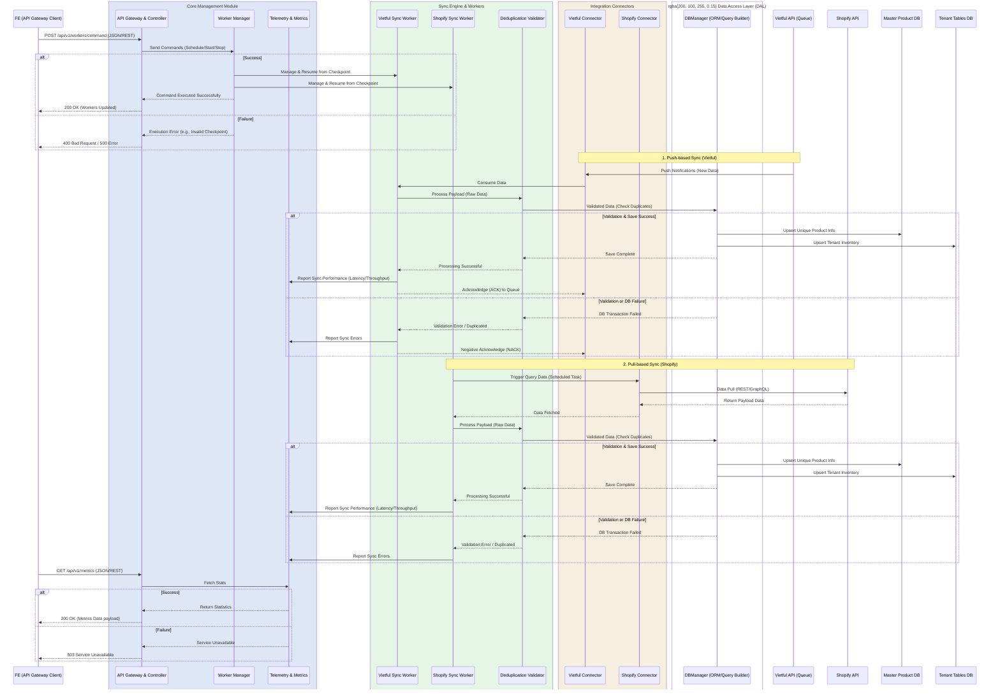

```mermaid
sequenceDiagram
    participant FE as FE (API Gateway Client)
    
    box rgba(100, 150, 255, 0.15) Core Management Module
        participant API as API Gateway & Controller
        participant WManager as Worker Manager
        participant Metrics as Telemetry & Metrics
    end
    
    box rgba(150, 255, 150, 0.15) Sync Engine & Workers
        participant VWorker as Vietful Sync Worker
        participant SWorker as Shopify Sync Worker
        participant Dedup as Deduplication Validator
    end
    
    box rgba(255, 200, 100, 0.15) Integration Connectors
        participant VConn as Vietful Connector
        participant SConn as Shopify Connector
    end
    
    box rgba(200, 100, 255, 0.15) Data Access Layer (DAL)
        participant DB as DBManager (ORM/Query Builder)
    end
    
    participant ExtVietful as Vietful API (Queue)
    participant ExtShopify as Shopify API
    participant MasterDB as Master Product DB
    participant TenantDB as Tenant Tables DB

    %% 1. Worker Command Flow (Schedule/Start/Stop)
    FE->>API: POST /api/v1/workers/command (JSON/REST)
    API->>WManager: Send Commands (Schedule/Start/Stop)
    
    alt Success
        WManager->>VWorker: Manage & Resume from Checkpoint
        WManager->>SWorker: Manage & Resume from Checkpoint
        WManager-->>API: Command Executed Successfully
        API-->>FE: 200 OK (Workers Updated)
    else Failure
        WManager-->>API: Execution Error (e.g., Invalid Checkpoint)
        API-->>FE: 400 Bad Request / 500 Error
    end

    %% 2. Vietful Sync Flow (Event-Driven / Push)
    Note over ExtVietful, VConn: 1. Push-based Sync (Vietful)
    ExtVietful->>VConn: Push Notifications (New Data)
    VConn->>VWorker: Consume Data
    VWorker->>Dedup: Process Payload (Raw Data)
    Dedup->>DB: Validated Data (Check Duplicates)
    
    alt Validation & Save Success
        DB->>MasterDB: Upsert Unique Product Info
        DB->>TenantDB: Upsert Tenant Inventory
        DB-->>Dedup: Save Complete
        Dedup-->>VWorker: Processing Successful
        VWorker->>Metrics: Report Sync Performance (Latency/Throughput)
        VWorker-->>VConn: Acknowledge (ACK) to Queue
    else Validation or DB Failure
        DB-->>Dedup: DB Transaction Failed
        Dedup-->>VWorker: Validation Error / Duplicated
        VWorker->>Metrics: Report Sync Errors
        VWorker-->>VConn: Negative Acknowledge (NACK)
    end

    %% 3. Shopify Sync Flow (Scheduled Poller / Pull)
    Note over SWorker, ExtShopify: 2. Pull-based Sync (Shopify)
    SWorker->>SConn: Trigger Query Data (Scheduled Task)
    SConn->>ExtShopify: Data Pull (REST/GraphQL)
    ExtShopify-->>SConn: Return Payload Data
    SConn-->>SWorker: Data Fetched
    SWorker->>Dedup: Process Payload (Raw Data)
    Dedup->>DB: Validated Data (Check Duplicates)
    
    alt Validation & Save Success
        DB->>MasterDB: Upsert Unique Product Info
        DB->>TenantDB: Upsert Tenant Inventory
        DB-->>Dedup: Save Complete
        Dedup-->>SWorker: Processing Successful
        SWorker->>Metrics: Report Sync Performance (Latency/Throughput)
    else Validation or DB Failure
        DB-->>Dedup: DB Transaction Failed
        Dedup-->>SWorker: Validation Error / Duplicated
        SWorker->>Metrics: Report Sync Errors
    end

    %% 4. Metrics Fetching Flow
    FE->>API: GET /api/v1/metrics (JSON/REST)
    API->>Metrics: Fetch Stats
    
    alt Success
        Metrics-->>API: Return Statistics
        API-->>FE: 200 OK (Metrics Data payload)
    else Failure
        Metrics-->>API: Service Unavailable
        API-->>FE: 503 Service Unavailable
    end
```