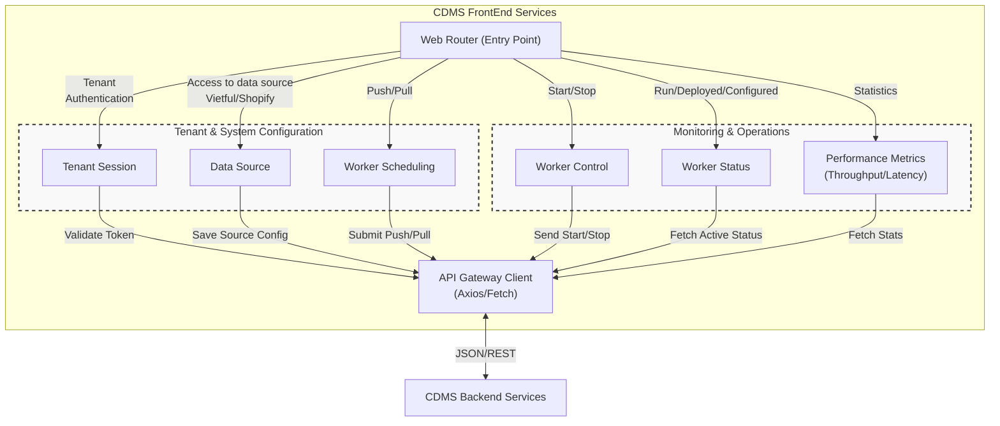

```mermaid
flowchart TD
    subgraph FEServices ["CDMS FrontEnd Services"]
        Router["Web Router (Entry Point)"]
        
        subgraph ConfigPkg ["Tenant & System Configuration"]
            Auth["Tenant Session"]
            DataSource["Data Source"]
            Schedule["Worker Scheduling"]
        end
        
        subgraph OpsPkg ["Monitoring & Operations"]
            WorkerControl["Worker Control"]
            WorkerStatus["Worker Status"]
            Metrics["Performance Metrics<br>(Throughput/Latency)"]
        end
        
        ApiClient["API Gateway Client<br>(Axios/Fetch)"]
    end

    Backend["CDMS Backend Services"]

    %% Tương tác từ Router
    Router -->|"Tenant<br>Authentication"| Auth
    Router -->|"Access to data source<br>Vietful/Shopify"| DataSource
    Router -->|"Push/Pull"| Schedule
    Router -->|"Start/Stop"| WorkerControl
    Router -->|"Run/Deployed/Configured"| WorkerStatus
    Router -->|"Statistics"| Metrics

    %% Tương tác tới ApiClient
    Auth -->|"Validate Token"| ApiClient
    DataSource -->|"Save Source Config"| ApiClient
    Schedule -->|"Submit Push/Pull"| ApiClient
    WorkerControl -->|"Send Start/Stop"| ApiClient
    WorkerStatus -->|"Fetch Active Status"| ApiClient
    Metrics -->|"Fetch Stats"| ApiClient

    %% Tương tác với hệ thống Backend
    ApiClient <-->|"JSON/REST"| Backend
    
    %% Tùy chỉnh màu sắc để phân biệt (Tùy chọn)
    classDef packageStyle fill:#f9f9f9,stroke:#333,stroke-width:2px,stroke-dasharray: 5 5;
    class ConfigPkg,OpsPkg packageStyle;
```