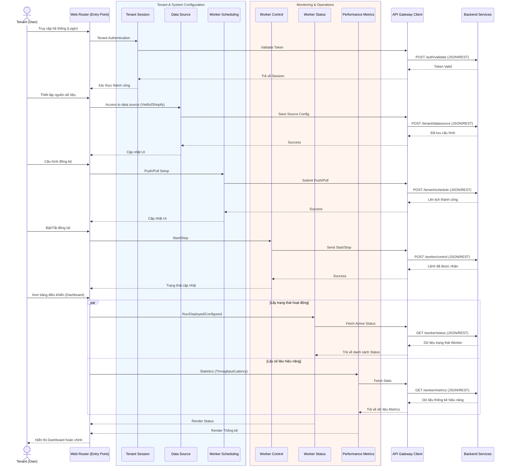

```mermaid
sequenceDiagram
    actor Tenant as Tenant (User)
    participant Router as Web Router (Entry Point)
    
    box rgb(240, 248, 255) Tenant & System Configuration
        participant Auth as Tenant Session
        participant DS as Data Source
        participant Sched as Worker Scheduling
    end
    
    box rgb(255, 245, 238) Monitoring & Operations
        participant WCtrl as Worker Control
        participant WStat as Worker Status
        participant Met as Performance Metrics
    end
    
    participant API as API Gateway Client
    participant BE as Backend Services

    %% 1. Luồng Xác thực (Authentication)
    Tenant->>Router: Truy cập hệ thống (Login)
    Router->>Auth: Tenant Authentication
    Auth->>API: Validate Token
    API->>BE: POST /auth/validate (JSON/REST)
    BE-->>API: Token Valid
    API-->>Auth: Trả về Session
    Auth-->>Router: Xác thực thành công

    %% 2. Luồng Cấu hình Nguồn Dữ liệu (Vietful/Shopify)
    Tenant->>Router: Thiết lập nguồn dữ liệu
    Router->>DS: Access to data source (Vietful/Shopify)
    DS->>API: Save Source Config
    API->>BE: POST /tenant/datasource (JSON/REST)
    BE-->>API: Đã lưu cấu hình
    API-->>DS: Success
    DS-->>Router: Cập nhật UI

    %% 3. Luồng Lên lịch Worker (Scheduling)
    Tenant->>Router: Cấu hình đồng bộ
    Router->>Sched: Push/Pull Setup
    Sched->>API: Submit Push/Pull
    API->>BE: POST /tenant/schedule (JSON/REST)
    BE-->>API: Lên lịch thành công
    API-->>Sched: Success
    Sched-->>Router: Cập nhật UI

    %% 4. Luồng Điều khiển Worker (Start/Stop)
    Tenant->>Router: Bật/Tắt đồng bộ
    Router->>WCtrl: Start/Stop
    WCtrl->>API: Send Start/Stop
    API->>BE: POST /worker/control (JSON/REST)
    BE-->>API: Lệnh đã được nhận
    API-->>WCtrl: Success
    WCtrl-->>Router: Trạng thái cập nhật

    %% 5. Luồng Xem Dashboard (Status & Metrics)
    Tenant->>Router: Xem bảng điều khiển (Dashboard)
    
    par Lấy trạng thái hoạt động
        Router->>WStat: Run/Deployed/Configured
        WStat->>API: Fetch Active Status
        API->>BE: GET /worker/status (JSON/REST)
        BE-->>API: Dữ liệu trạng thái Worker
        API-->>WStat: Trả về danh sách Status
    and Lấy số liệu hiệu năng
        Router->>Met: Statistics (Throughput/Latency)
        Met->>API: Fetch Stats
        API->>BE: GET /worker/metrics (JSON/REST)
        BE-->>API: Dữ liệu thống kê hiệu năng
        API-->>Met: Trả về dữ liệu Metrics
    end
    
    WStat-->>Router: Render Status
    Met-->>Router: Render Thống kê
    Router-->>Tenant: Hiển thị Dashboard hoàn chỉnh
```