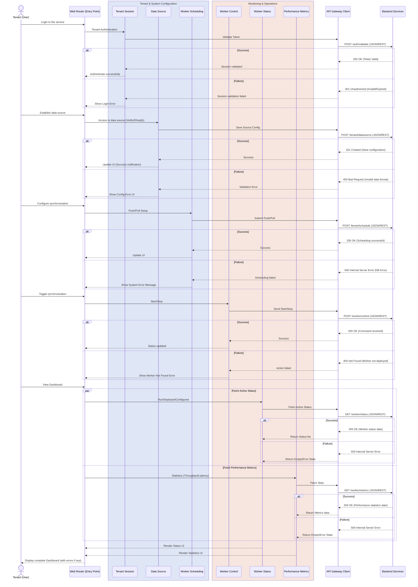

```mermaid
sequenceDiagram
    actor Tenant as Tenant (User)
    participant Router as Web Router (Entry Point)
    
    box rgba(100, 150, 255, 0.15) Tenant & System Configuration
        participant Auth as Tenant Session
        participant DS as Data Source
        participant Sched as Worker Scheduling
    end
    
    box rgba(255, 150, 100, 0.15) Monitoring & Operations
        participant WCtrl as Worker Control
        participant WStat as Worker Status
        participant Met as Performance Metrics
    end
    
    participant API as API Gateway Client
    participant BE as Backend Services

    %% 1. Authentication Flow
    Tenant->>Router: Login to the service
    Router->>Auth: Tenant Authentication
    Auth->>API: Validate Token
    API->>BE: POST /auth/validate (JSON/REST)
    
    alt Success
        BE-->>API: 200 OK (Token Valid)
        API-->>Auth: Session validated
        Auth-->>Router: Authenticate successfully
    else Failure
        BE-->>API: 401 Unauthorized (Invalid/Expired)
        API-->>Auth: Session validation failed
        Auth-->>Router: Show Login Error
    end

    %% 2. Data Source Configuration Flow (Vietful/Shopify)
    Tenant->>Router: Establish data source
    Router->>DS: Access to data source (Vietful/Shopify)
    DS->>API: Save Source Config
    API->>BE: POST /tenant/datasource (JSON/REST)
    
    alt Success
        BE-->>API: 201 Created (Save configuration)
        API-->>DS: Success
        DS-->>Router: Update UI (Success notification)
    else Failure
        BE-->>API: 400 Bad Request (Invalid data format)
        API-->>DS: Validation Error
        DS-->>Router: Show Config Error UI
    end

    %% 3. Worker Scheduling Flow
    Tenant->>Router: Configure synchronization
    Router->>Sched: Push/Pull Setup
    Sched->>API: Submit Push/Pull
    API->>BE: POST /tenant/schedule (JSON/REST)
    
    alt Success
        BE-->>API: 200 OK (Scheduling successful)
        API-->>Sched: Success
        Sched-->>Router: Update UI
    else Failure
        BE-->>API: 500 Internal Server Error (DB Error)
        API-->>Sched: Scheduling failed
        Sched-->>Router: Show System Error Message
    end

    %% 4. Worker Control Flow (Start/Stop)
    Tenant->>Router: Toggle synchronization
    Router->>WCtrl: Start/Stop
    WCtrl->>API: Send Start/Stop
    API->>BE: POST /worker/control (JSON/REST)
    
    alt Success
        BE-->>API: 200 OK (Command received)
        API-->>WCtrl: Success
        WCtrl-->>Router: Status updated
    else Failure
        BE-->>API: 404 Not Found (Worker not deployed)
        API-->>WCtrl: Action failed
        WCtrl-->>Router: Show Worker Not Found Error
    end

    %% 5. Dashboard View Flow (Status & Metrics)
    Tenant->>Router: View Dashboard
    
    par Fetch Active Status
        Router->>WStat: Run/Deployed/Configured
        WStat->>API: Fetch Active Status
        API->>BE: GET /worker/status (JSON/REST)
        
        alt Success
            BE-->>API: 200 OK (Worker status data)
            API-->>WStat: Return Status list
        else Failure
            BE-->>API: 500 Internal Server Error
            API-->>WStat: Return Empty/Error State
        end
        
    and Fetch Performance Metrics
        Router->>Met: Statistics (Throughput/Latency)
        Met->>API: Fetch Stats
        API->>BE: GET /worker/metrics (JSON/REST)
        
        alt Success
            BE-->>API: 200 OK (Performance statistics data)
            API-->>Met: Return Metrics data
        else Failure
            BE-->>API: 500 Internal Server Error
            API-->>Met: Return Empty/Error State
        end
    end
    
    WStat-->>Router: Render Status UI
    Met-->>Router: Render Statistics UI
    Router-->>Tenant: Display complete Dashboard (with errors if any)
```